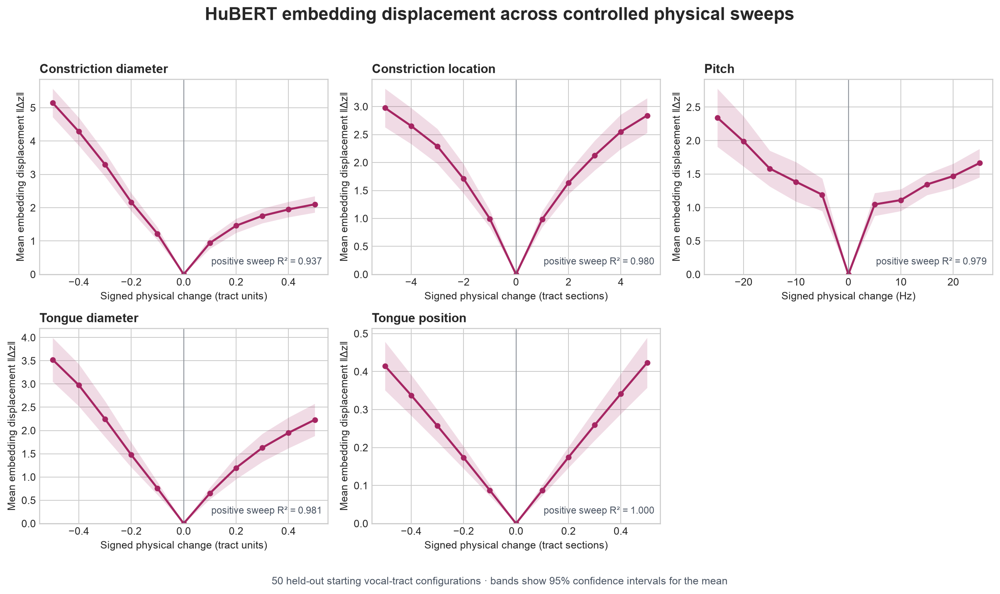

# Experiment 2: Directions of Physical Displacement in HuBERT Space

## Method

- Extractor: `facebook/hubert-base-ls960` at `dba3bb02fda4248b6e082697eee756de8fe8aa8a`
- Base configurations: 50
- Embedding dimension: 768
- Matched synthesis noise within each base/intervention set: True
- Evaluation splits keep every intervention from a base configuration in the same fold.

Lines show the mean embedding displacement norm over base configurations; shaded regions are 95% confidence intervals for the mean. Panel scales differ because the controls use different physical units.

## Direction consistency at the largest positive intervention

| Transformation | Delta | Pairwise cosine | Leave-one-out alignment | Resultant strength | Nonzero | Raw p | Holm p |
| --- | ---: | ---: | ---: | ---: | ---: | ---: | ---: |
| `constrictionDiameter` | 0.5 | 0.0814 | 0.2549 | 0.3189 | 1.000 | 0.0003999 | 0.0016 |
| `constrictionIndex` | 5 | 0.0031 | 0.0041 | 0.1467 | 1.000 | 0.4517 | 0.4517 |
| `pitchHz` | 25 | 0.0885 | 0.2641 | 0.3170 | 1.000 | 0.0005999 | 0.0018 |
| `tongueDiameter` | 0.5 | 0.1397 | 0.3499 | 0.4623 | 1.000 | 0.0002 | 0.0009998 |
| `tongueIndex` | 0.5 | 0.0224 | 0.1121 | 0.2284 | 1.000 | 0.02959 | 0.05919 |

Leave-one-out alignment compares each displacement with the mean of all *other* displacements, avoiding the optimistic self-inclusion of the ordinary mean vector.

## Positive-delta magnitude linearity

| Transformation | Mean-curve R² | Through-origin R² | Median within-base R² | Small→largest cosine |
| --- | ---: | ---: | ---: | ---: |
| `constrictionDiameter` | 0.9370 | 0.2438 | 0.9159 | 0.6449 |
| `constrictionIndex` | 0.9796 | 0.8076 | 0.9270 | 0.3358 |
| `pitchHz` | 0.9786 | -1.5395 | 0.5004 | 0.5288 |
| `tongueDiameter` | 0.9806 | 0.9069 | 0.9851 | 0.7439 |
| `tongueIndex` | 0.9998 | 0.9994 | 0.9994 | 0.9633 |

## Held-out transformation classification

- Direction-only balanced accuracy: **0.581**
- Base-group bootstrap 95% CI: **0.543–0.618**
- Macro F1: **0.576**
- Chance balanced accuracy: **0.200**

## Held-out signed-magnitude regression

| Transformation | R² | MAE | Direction accuracy |
| --- | ---: | ---: | ---: |
| `constrictionDiameter` | 0.8175 | 0.1060 | 0.956 |
| `constrictionIndex` | 0.3133 | 1.9410 | 0.832 |
| `pitchHz` | 0.7430 | 6.5941 | 0.914 |
| `tongueDiameter` | 0.7149 | 0.1353 | 0.954 |
| `tongueIndex` | 0.1761 | 0.2278 | 0.682 |

## Main finding

Tongue-position change is highly linear *within* a starting tract: its positive mean displacement curve has R² **0.9998**, the median within-base R² is **0.9994**, and the smallest positive displacement aligns with the largest at cosine **0.9633**. This is strong evidence for a stable local trajectory.

The trajectory is not a strong global tongue-forward direction across starting tracts. At `+0.5`, mean pairwise cosine is only **0.0224**, leave-one-out alignment is **0.1121**, and the Holm-adjusted sign-flip p-value is **0.0592**. On unseen starting tracts, signed tongue magnitude has R² **0.1761**, and transformation-class recall for tongue position is **0.332**.

Across all five controls, direction-only classification reaches balanced accuracy **0.581** versus **0.200** chance. HuBERT therefore preserves useful information about the kind of physical transformation, but that information is context-dependent rather than one universal vector per control.

## Interpretation boundary

Consistent displacement directions support a stable transformation in this representation for this synthesizer and intervention range. They do not by themselves establish articulatory causality, phoneme identity, or generalization to natural speech.
