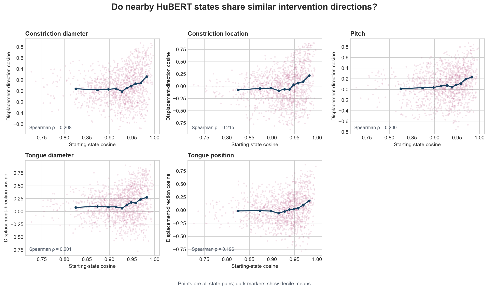
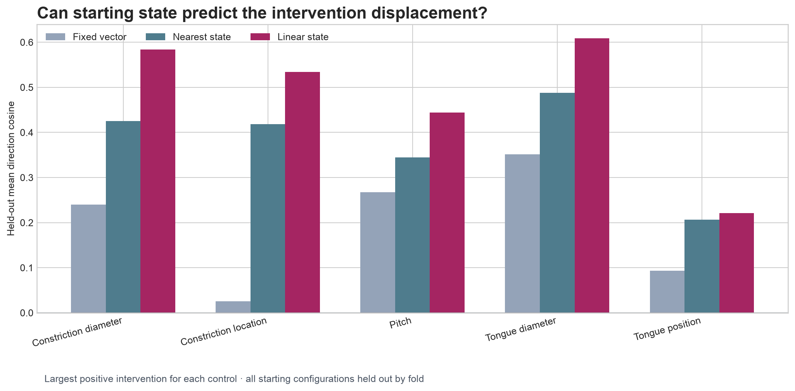

# Experiment 3: State-Dependent Displacement Fields in HuBERT

## Question

Does the starting HuBERT representation predict how a controlled physical intervention will move that representation?

This analysis reuses the paired embeddings from Experiment 2. It introduces no new synthesis or model inference. Every prediction is evaluated on completely held-out starting vocal-tract configurations.

## Data and safeguards

- Extractor: `facebook/hubert-base-ls960` at `dba3bb02fda4248b6e082697eee756de8fe8aa8a`
- Starting configurations: 50
- Pairwise comparisons per transformation: 1225
- Embedding dimension: 768
- Matched synthesis noise within each intervention set: True
- Pairwise significance uses a label-permutation test; predictor significance uses paired sign flips. Both families use Holm correction.

## Does state proximity predict direction proximity?

| Transformation | Spearman ρ | Jackknife 95% CI | Nearest-state cosine | All-pair cosine | Holm p |
| --- | ---: | ---: | ---: | ---: | ---: |
| `constrictionDiameter` | 0.208 | 0.097–0.319 | 0.431 | 0.081 | 0.0005 |
| `constrictionIndex` | 0.215 | 0.086–0.344 | 0.425 | 0.003 | 0.0005 |
| `pitchHz` | 0.200 | 0.091–0.309 | 0.374 | 0.088 | 0.0005 |
| `tongueDiameter` | 0.201 | 0.048–0.353 | 0.506 | 0.140 | 0.0005 |
| `tongueIndex` | 0.196 | 0.069–0.324 | 0.216 | 0.022 | 0.0005 |

The nearest-state column selects, for each configuration, the other configuration with the highest starting-state cosine and then measures the cosine between their displacement vectors.

## Can starting state predict the largest positive displacement?

| Transformation | Fixed vector cosine | Nearest-state cosine | Linear state cosine | Linear MSE gain | Holm p |
| --- | ---: | ---: | ---: | ---: | ---: |
| `constrictionDiameter` | 0.240 | 0.425 | 0.584 | 0.309 | 0.0005 |
| `constrictionIndex` | 0.026 | 0.419 | 0.534 | 0.362 | 0.0005 |
| `pitchHz` | 0.267 | 0.345 | 0.444 | 0.084 | 0.0014 |
| `tongueDiameter` | 0.351 | 0.488 | 0.609 | 0.520 | 0.0005 |
| `tongueIndex` | 0.093 | 0.207 | 0.221 | -0.165 | 0.0019 |

The fixed-vector baseline learns one mean displacement from each training fold. The nearest-state predictor copies the displacement of the closest training state. The linear predictor fits `Δz = Az + b`, with its ridge penalty selected inside each training fold.

## Tongue field model across all signed magnitudes

For each starting tract, a local tongue field is estimated from all signed intervention sizes using the through-origin slope

`vᵢ = Σδ δΔzᵢ(δ) / Σδ δ²`.

The held-out predictor then fits `v̂ = Az + b` and reconstructs a displacement as `Δẑ = δv̂`.

| Predictor | Mean direction cosine | MSE ratio to fixed | MSE improvement |
| --- | ---: | ---: | ---: |
| Fixed field | 0.115 | 1.000 | 0.000 |
| Nearest state | 0.232 | 1.389 | -0.389 |
| Linear state | 0.259 | 1.119 | -0.119 |

## Main finding

For tongue position, starting-state similarity and local direction similarity have Spearman ρ **0.196** (Holm p **0.0005**). The nearest starting state has mean direction cosine **0.216**, compared with **0.022** over every pair.

For the `+0.5` tongue intervention, the fixed-vector, nearest-state, and linear-state predictors reach mean held-out direction cosines **0.093**, **0.207**, and **0.221**, respectively. The linear model's MSE change relative to the fixed vector is **-0.165**.

The positive proximity result and held-out directional improvement support a smoothly state-dependent direction field rather than either a universal translation vector or unstructured variation. They do **not** yet establish accurate full-vector prediction for tongue position: the linear model improves direction while worsening MSE by **0.165** relative to the fixed-vector baseline.

## Interpretation boundary

The predictors operate on synthetic Pink Trombone states and HuBERT's final-layer time-mean representation. Generalization to natural speech, other HuBERT layers, or explicitly articulatory representations remains untested.
