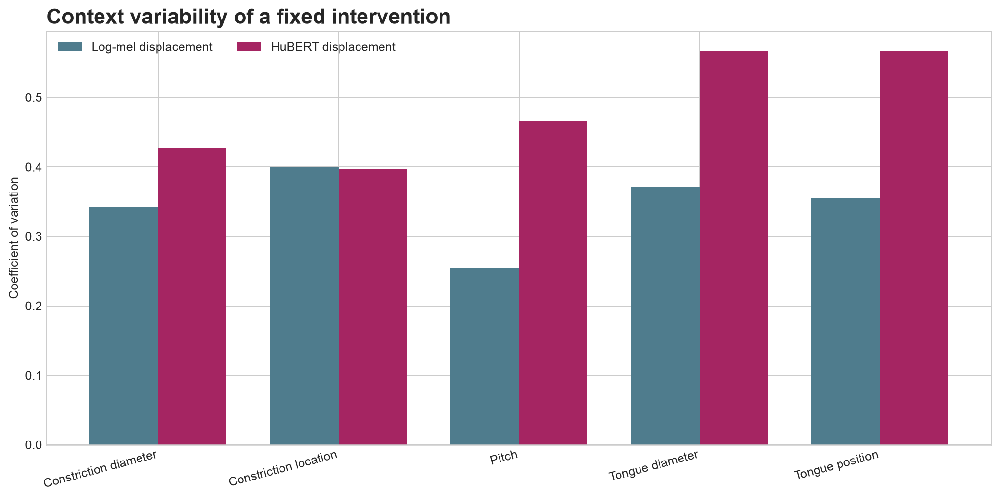
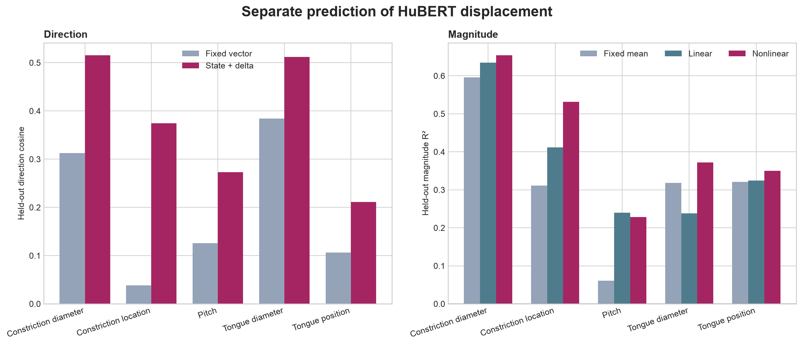
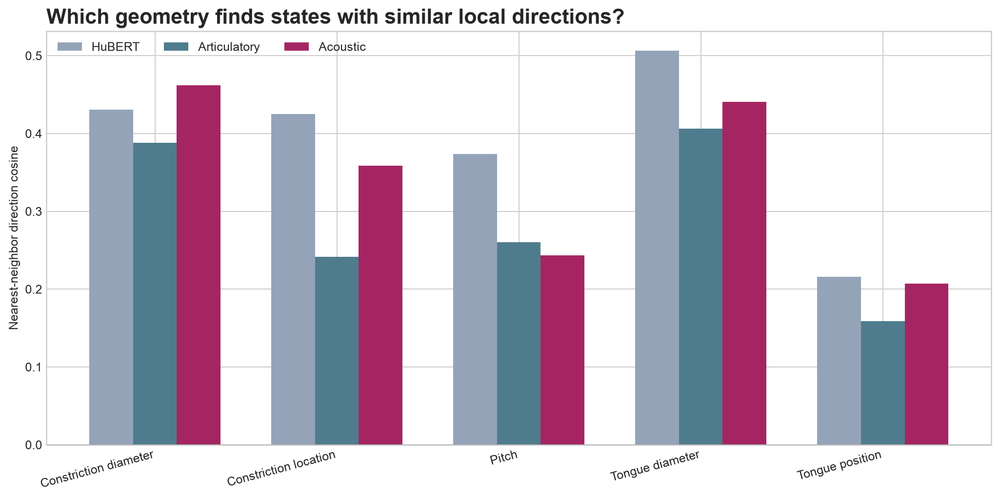

# Experiment 4: Why Is Tongue Position Harder to Predict?

## Question

Is tongue-position displacement difficult because its acoustic consequences are unusually variable, because direction and magnitude require different models, or because HuBERT similarity is not the best neighborhood geometry?

## Data and safeguards

- Starting configurations: 50
- HuBERT extractor: `facebook/hubert-base-ls960` at `dba3bb02fda4248b6e082697eee756de8fe8aa8a`
- Acoustic representation: flattened-log-mel-power (720 dimensions)
- Acoustic comparisons reuse Experiment 2's synthesis seed, duration, warmup, and paired-noise design.
- Every learned prediction holds out complete starting configurations and keeps every magnitude from a base in the same fold.

## 1. Is acoustic change unusually variable?

| Transformation | Acoustic CV | HuBERT CV | Norm correlation ρ | Acoustic direction cosine | HuBERT direction cosine |
| --- | ---: | ---: | ---: | ---: | ---: |
| `constrictionDiameter` | 0.343 | 0.427 | 0.577 | 0.420 | 0.081 |
| `constrictionIndex` | 0.400 | 0.397 | 0.618 | 0.060 | 0.003 |
| `pitchHz` | 0.255 | 0.467 | 0.222 | 0.378 | 0.088 |
| `tongueDiameter` | 0.371 | 0.566 | 0.748 | 0.252 | 0.140 |
| `tongueIndex` | 0.355 | 0.567 | 0.542 | 0.176 | 0.022 |

Across controls and after standardizing within each control, acoustic and HuBERT displacement magnitudes have Spearman ρ **0.549** with a base-block permutation p-value of **9.999e-05**. The correlation between the five acoustic CVs and five HuBERT CVs is exploratory because there are only five controls.

## 2. Do direction and magnitude require different models?

| Transformation | Fixed direction | Linear direction | Fixed magnitude R² | Linear magnitude R² | Nonlinear magnitude R² | Recombined MSE gain | Direction Holm p |
| --- | ---: | ---: | ---: | ---: | ---: | ---: | ---: |
| `constrictionDiameter` | 0.313 | 0.516 | 0.596 | 0.635 | 0.654 | 0.190 | 0.0005 |
| `constrictionIndex` | 0.038 | 0.374 | 0.311 | 0.412 | 0.531 | 0.107 | 0.0005 |
| `pitchHz` | 0.125 | 0.273 | 0.061 | 0.240 | 0.229 | -0.103 | 0.0005 |
| `tongueDiameter` | 0.384 | 0.512 | 0.318 | 0.238 | 0.372 | 0.164 | 0.0005 |
| `tongueIndex` | 0.106 | 0.211 | 0.321 | 0.325 | 0.350 | -0.248 | 0.0024 |

Direction models fit unit displacement vectors. Magnitude models predict `log ‖Δz‖`; the nonlinear model is a random forest. Inputs contain a training-fold PCA of the starting HuBERT state plus signed and absolute intervention size. Ridge penalties are selected only inside each training fold.

## 3. Which neighborhood best predicts the local direction?

| Transformation | HuBERT nearest | Articulatory nearest | Acoustic nearest | HuBERT ρ | Articulatory ρ | Acoustic ρ |
| --- | ---: | ---: | ---: | ---: | ---: | ---: |
| `constrictionDiameter` | 0.431 | 0.388 | 0.462 | 0.208 | 0.275 | 0.205 |
| `constrictionIndex` | 0.425 | 0.241 | 0.358 | 0.215 | 0.159 | 0.135 |
| `pitchHz` | 0.374 | 0.260 | 0.243 | 0.200 | 0.170 | 0.210 |
| `tongueDiameter` | 0.506 | 0.406 | 0.440 | 0.201 | 0.245 | 0.209 |
| `tongueIndex` | 0.216 | 0.159 | 0.207 | 0.196 | 0.096 | 0.190 |

Articulatory distance is standardized Euclidean distance over the five controlled base parameters. Acoustic distance is standardized Euclidean distance over the time-mean 40-bin log-mel spectrum. HuBERT distance is cosine distance.

## Tongue-position result

- Acoustic magnitude CV: **0.355**; HuBERT magnitude CV: **0.567**.
- Direction prediction improves from **0.106** to **0.211**.
- Magnitude R² is **0.325** for the linear model and **0.350** for the nonlinear model.
- Nearest-neighbor direction cosine is **0.216** in HuBERT space, **0.159** in articulatory space, and **0.207** in acoustic space.

## Main finding

The simple acoustic-variability hypothesis is not supported: tongue position is not the most variable control in log-mel displacement magnitude; `constrictionIndex` is. Acoustic magnitude still matters—within-control acoustic and HuBERT displacement norms correlate strongly—but it does not explain why tongue position is uniquely hard.

Separating direction from magnitude clarifies the failure. Tongue direction prediction improves significantly over the fixed-vector baseline (Holm p **0.0024**), while nonlinear magnitude prediction improves only slightly over the fixed per-delta mean and the recombined full vector remains worse than baseline. The obstacle is therefore not magnitude alone.

HuBERT and acoustic neighborhoods are numerically similar for tongue position, and none of the three pairwise neighborhood comparisons is significant after Holm correction (smallest adjusted p **1.000**). These data do not show that the wrong neighborhood metric caused the difficulty.

Taken together, tongue position appears difficult because its displacement field contains residual, high-dimensional state dependence that is only partly captured by the current HuBERT-state, delta-interaction, and low-level acoustic models—not because tongue movement simply produces more variable acoustic magnitude.

## Interpretation boundary

These results compare one synthetic vocal-tract generator, one HuBERT checkpoint and layer pooling scheme, five controls, and 50 starting configurations. The acoustic metric is deliberately low-level and does not establish perceptual equivalence or articulatory causality.
