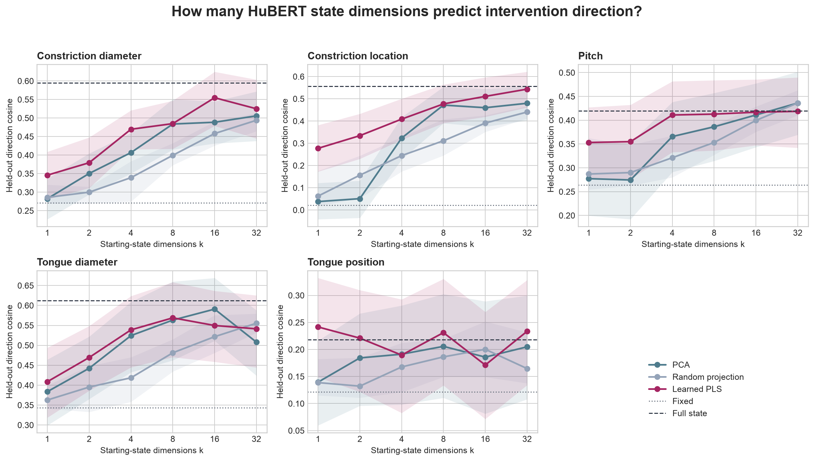
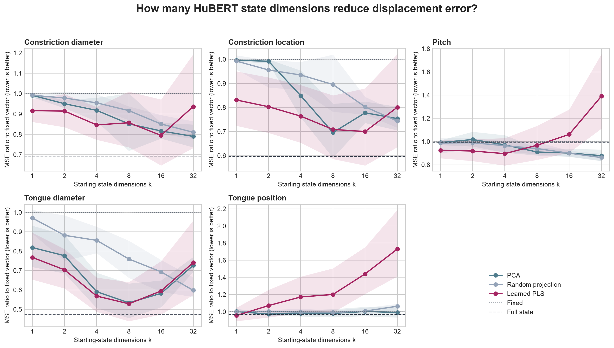

# Experiment 5: Dimensionality of Intervention-Relevant HuBERT State

## Question

Can the starting-state information needed to predict a fixed intervention be compressed into a small subspace, or does performance continue improving as more HuBERT dimensions are exposed?

## Method

- Extractor: `facebook/hubert-base-ls960` at `dba3bb02fda4248b6e082697eee756de8fe8aa8a`
- Starting configurations: 50
- Input embedding dimension: 768
- Tested state dimensions: 1, 2, 4, 8, 16, 32
- Target: largest positive displacement vector for each intervention.
- Every projection and predictor is fit only inside each outer training fold.
- PCA and Gaussian random projections use ridge prediction; supervised projections use partial least squares (PLS).
- Random projections are repeated 12 times per dimension.

Because there are only 50 starting configurations and 40 training configurations per outer fold, this experiment cannot identify more than 39 independent training-state directions. The sweep stops at 32 rather than making unsupported claims about 64–768 dimensions.

PCA and PLS bands bootstrap held-out starting configurations. Random-projection bands show variation over projection draws. The two uncertainty sources should not be interpreted as interchangeable confidence intervals.

## Best supervised projection by control

| Transformation | Fixed cosine | Full-state cosine | Best PLS k | Best PLS cosine | Best PLS MSE ratio |
| --- | ---: | ---: | ---: | ---: | ---: |
| `constrictionDiameter` | 0.271 | 0.595 | 16 | 0.555 | 0.795 |
| `constrictionIndex` | 0.021 | 0.556 | 32 | 0.543 | 0.801 |
| `pitchHz` | 0.264 | 0.420 | 32 | 0.419 | 1.391 |
| `tongueDiameter` | 0.343 | 0.613 | 8 | 0.569 | 0.528 |
| `tongueIndex` | 0.121 | 0.218 | 1 | 0.242 | 0.955 |

## Tongue-position curve

| k | PCA cosine | Random cosine | Learned PLS cosine | Learned PLS MSE ratio |
| ---: | ---: | ---: | ---: | ---: |
| 1 | 0.139 | 0.139 | 0.242 | 0.955 |
| 2 | 0.184 | 0.132 | 0.221 | 1.071 |
| 4 | 0.191 | 0.168 | 0.190 | 1.172 |
| 8 | 0.206 | 0.186 | 0.231 | 1.201 |
| 16 | 0.186 | 0.200 | 0.171 | 1.441 |
| 32 | 0.205 | 0.165 | 0.234 | 1.731 |

The full-state ridge reference reaches direction cosine **0.218** and MSE ratio **0.973**. The strongest supervised tongue projection uses **1** dimensions, reaching cosine **0.242** and MSE ratio **0.955**.

## Main finding

The tested high-dimensional explanation is not supported for tongue direction. A one-dimensional supervised PLS score reaches direction cosine **0.242**, compared with **0.139** for one-dimensional PCA and **0.139** for one-dimensional random projection. The supervised advantage is significant after correction across the six tested dimensions (Holm p **0.0018** versus PCA and **0.0012** versus random).

The one-dimensional supervised score is statistically compatible with the full-state ridge reference: their direction-cosine difference is **0.023**, with bootstrap 95% interval **-0.009–0.057**. Exposing more supervised dimensions does not produce a rising tongue curve and progressively worsens vector MSE.

This suggests that the predictable *directional* part of the tongue response can be compressed into one intervention-specific linear score hidden across the original 768 coordinates. It does not solve the prediction problem: direction cosine remains low and vector MSE stays close to the fixed baseline even at `k=1`. Other interventions show broader dimensional requirements, with their descriptive PLS optima between 8 and 32 dimensions.

## Interpretation boundary

PLS is a linear supervised projection. Its one-dimensional score is a learned weighted combination of all 768 coordinates, not one original HuBERT coordinate. Success at small `k` identifies a compact predictive subspace for this synthetic intervention, not a uniquely articulatory or causal variable. The reported best `k` values are descriptive choices from the held-out curves rather than independently nested model selections. The 50-state sample size limits the tested effective dimensionality to 32.
