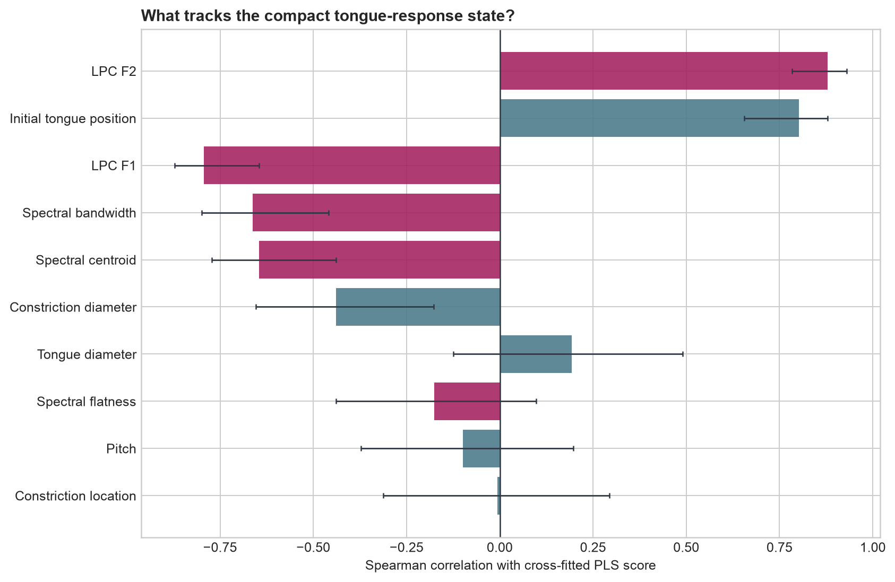
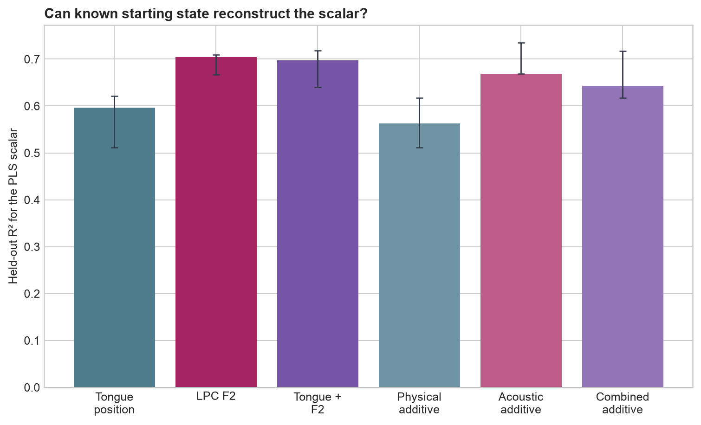

# Experiment 6: What Does the Tongue-Response PLS Scalar Represent?

## Question

Does the compact HuBERT state identified in Experiment 5 correspond to a known starting vocal-tract parameter or acoustic property?

## Method

- Extractor: `facebook/hubert-base-ls960` at `dba3bb02fda4248b6e082697eee756de8fe8aa8a`
- Starting configurations: 50
- Intervention: `tongueIndex +0.5`
- Score: one-component PLS state, trained in five folds so every reported scalar is produced by a model that did not see that starting configuration's intervention target.
- Physical candidates: the five randomized Pink Trombone starting controls.
- Acoustic candidates: framewise LPC F1/F2 plus spectral centroid, bandwidth, and flatness from the exact matched-noise starting audio.
- Univariate inference: paired bootstrap intervals, permutation tests, and Holm correction across 10 candidates.
- Multivariable inference: training-fold imputation/scaling and ridge selection, outer held-out predictions, permutation tests, and 25 repeated five-fold split checks.

The five fold-specific PLS axes have mean absolute cosine **0.967** with the full-data axis (minimum **0.941**). Cross-fitted and full-data scores correlate at Spearman ρ **0.974**. The re-rendered audio reproduces the saved log-mel cache with maximum absolute difference **0**.

## Individual physical and acoustic associations

| Candidate | Type | Spearman ρ | Bootstrap 95% interval | Linear R² | Holm p |
| --- | --- | ---: | ---: | ---: | ---: |
| LPC F2 | acoustic | 0.879 | 0.784–0.930 | 0.717 | 0.0009999 |
| Initial tongue position | physical | 0.802 | 0.655–0.879 | 0.630 | 0.0009999 |
| LPC F1 | acoustic | -0.793 | -0.872–-0.646 | 0.600 | 0.0009999 |
| Spectral bandwidth | acoustic | -0.662 | -0.799–-0.459 | 0.410 | 0.0009999 |
| Spectral centroid | acoustic | -0.646 | -0.772–-0.439 | 0.437 | 0.0009999 |
| Constriction diameter | physical | -0.438 | -0.654–-0.177 | 0.143 | 0.008499 |
| Tongue diameter | physical | 0.193 | -0.125–0.491 | 0.054 | 0.7055 |
| Spectral flatness | acoustic | -0.176 | -0.440–0.097 | 0.023 | 0.7055 |
| Pitch | physical | -0.099 | -0.372–0.197 | 0.022 | 0.9867 |
| Constriction location | physical | -0.006 | -0.312–0.295 | 0.001 | 0.9867 |

The strongest individual correlate is **LPC F2** (Spearman ρ **0.879**, Holm p **0.0009999**).

## Can known state variables explain the scalar jointly?

| State description | Raw features | Held-out R² | Repeated-split 95% range | Prediction ρ | Holm p |
| --- | ---: | ---: | ---: | ---: | ---: |
| Initial tongue position only | 1 | 0.597 | 0.511–0.621 | 0.787 | 0.005994 |
| LPC F2 only | 1 | 0.705 | 0.667–0.709 | 0.876 | 0.005994 |
| Initial tongue position + LPC F2 | 2 | 0.697 | 0.640–0.718 | 0.866 | 0.005994 |
| Physical parameters (additive) | 5 | 0.563 | 0.511–0.618 | 0.800 | 0.005994 |
| Acoustic measurements (additive) | 5 | 0.669 | 0.678–0.736 | 0.885 | 0.005994 |
| Physical + acoustic (additive) | 10 | 0.643 | 0.617–0.718 | 0.864 | 0.005994 |

The strongest tested state description is **LPC F2 only**, with held-out R² **0.705** and prediction ρ **0.876**. This is an explanation of the cross-fitted scalar, not another HuBERT displacement predictor.

Initial tongue position and LPC F2 are themselves strongly associated (Spearman ρ **0.794**). Comparing their held-out models therefore matters more than comparing their raw correlations alone. F2 by itself reaches R² **0.705**, versus **0.597** for initial tongue position; using both reaches **0.697**.

Across the same 25 repeated partitions, F2 improves R² over tongue position by a median **0.088** (split range **0.074–0.162**). Adding tongue position to F2 changes R² by median **0.011** (split range **-0.034–0.026**). These split ranges describe robustness to partition choice, not independent confidence intervals.

## Interpretation

The compact state is best described by the starting second-formant configuration among the variables tested. The raw tongue coordinate is also strongly related, but it does not improve held-out reconstruction when added to F2. This is consistent with the scalar tracking the acoustic consequence of the starting tongue configuration more directly than the simulator coordinate itself. It does not establish that F2 causally mediates HuBERT's response.

The scalar's sign is conventional: reversing the PLS axis reverses every signed correlation but leaves association magnitude, p-values, and regression performance unchanged.

## Limitations

There are only 50 synthetic starting states. LPC formants are estimates from short synthesized clips, not measured human vocal-tract resonances. The PLS axis is defined using HuBERT responses from this same intervention dataset, although each analyzed score is cross-fitted. Correlation does not establish that HuBERT explicitly encodes an anatomical variable or that the relationship transfers to natural speech.
